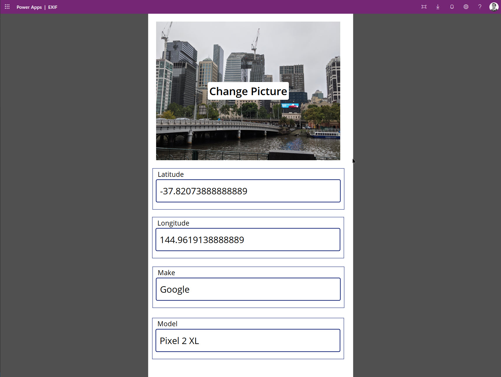

# Summary
PCF Component to show EXIF metadata from JPG images.

# Installation
* Download [PCF Component Solution](https://github.com/rajyraman/Image-Metadata-PCF/releases/download/v1.0/ImageMetadataPCF.zip)
* You can also download a [sample app](https://github.com/rajyraman/Image-Metadata-PCF/releases/download/v1.0/EXIFMetadata_20200216101438.zip)

# Sample App
